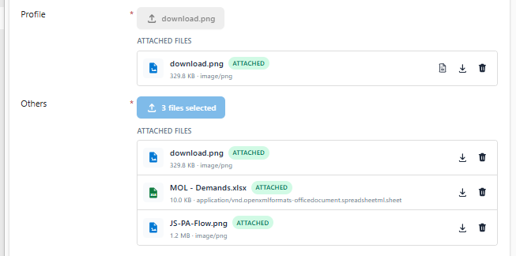

# FileUploadControl (PCF)

A production-ready PowerApps Component Framework control that reproduces the
experience of a native Dataverse **File** column on a **Create** form — even
though Dataverse itself cannot accept file uploads until the record exists.

This project was built and verified end-to-end with the real PCF toolchain
(`pcf-scripts`): manifest validation, TypeScript strict-mode compilation,
ESLint, and webpack bundling all pass cleanly (`npm run build`).

---
### Buttons

### Button & DropZone

